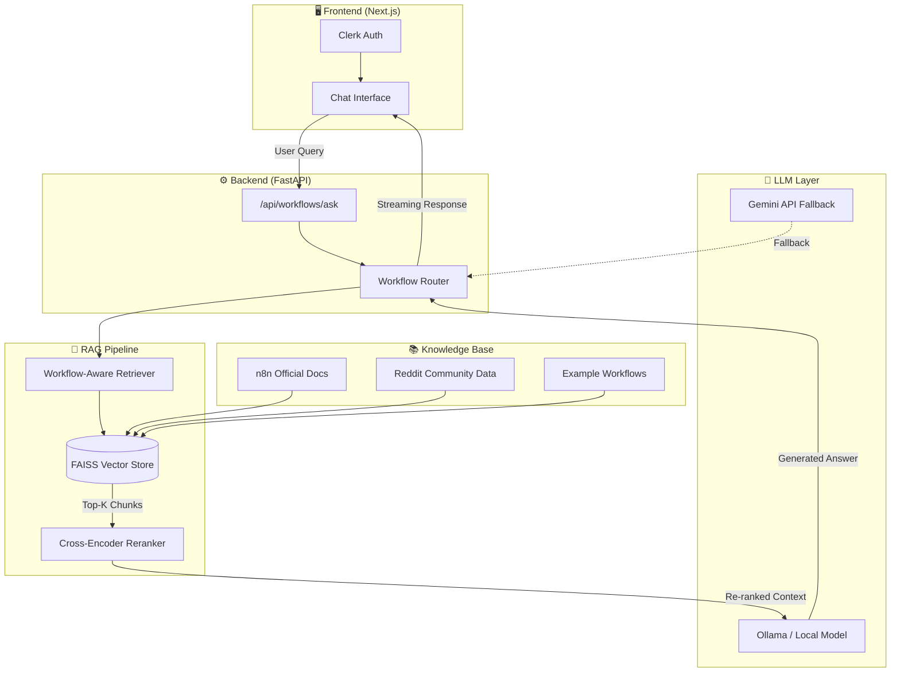

<div align="center">

# 🤖 n8n Workflow Orchestrator

### Your Private, AI-Powered Assistant for n8n Automation

[](https://fastapi.tiangolo.com)
[](https://nextjs.org)
[](https://ollama.com)

*Stop searching through endless documentation. Start building workflows with AI that understands n8n.*

[Getting Started](#-getting-started) • [Architecture](#-architecture) • [Features](#-features) • [API Reference](API_REFERENCE.md)

</div>

---

## 📋 Table of Contents

- [The Problem We Solve](#-the-problem-we-solve)
- [Why Local LLM?](#-why-local-llm)
- [Architecture](#-architecture)
- [Tech Stack](#-tech-stack)
- [Features](#-features)
- [Getting Started](#-getting-started)
- [Usage](#-usage)
- [Future Roadmap](#-future-roadmap)

---

## 🎯 The Problem We Solve

**n8n is powerful—but mastering it takes time.**

Every n8n developer knows the struggle:
- 📚 Hunting through 400+ node documentations to find the right configuration
- 🔍 Searching Reddit threads for "how do I connect Telegram to MongoDB?"
- ⏰ Spending hours debugging a workflow that "should just work"

**Workflow Orchestrator** is a specialized **RAG-based AI assistant** that has ingested n8n's entire official documentation and community knowledge. Ask it anything about n8n—in plain English—and get accurate, context-aware answers instantly.

> *"How do I set up a Telegram trigger that stores messages in PostgreSQL?"*
>
> The assistant retrieves relevant documentation chunks, understands the multi-step workflow pattern, and provides step-by-step guidance with actual node configurations.

---

## 🔒 Why Local LLM?

This project is designed with **local-first AI** at its core. Here's why that matters:

| Benefit | Description |
|:--------|:------------|
| **🔐 Complete Privacy** | Your workflow logic, API keys, and business processes never leave your machine. No data sent to OpenAI, Anthropic, or any cloud provider. |
| **💰 Zero API Costs** | After initial setup, every query is free. No per-token billing, no surprise invoices. |
| **📴 Offline Capable** | Works without internet. Perfect for air-gapped environments or unreliable connections. |
| **⚡ Low Latency** | No network round-trips to cloud APIs. Responses generated directly on your hardware. |
| **🎛️ Full Control** | Choose your model (Llama 3.2, DeepSeek, Phi-3), tune parameters, no vendor lock-in. |

**Supported LLM Backends:**
- 🦙 **Ollama** (Recommended) — Llama 3.2, DeepSeek-R1, Phi-3, Gemma
- ☁️ **Gemini API** — Optional cloud fallback for users without local GPU

---

## 🏗 Architecture

The system follows a modern RAG (Retrieval-Augmented Generation) architecture that ensures accurate, grounded responses:



### Data Flow

1. **User submits a question** via the chat interface
2. **Query is embedded** using Sentence Transformers (`all-MiniLM-L6-v2`)
3. **FAISS retrieves** the top-k most similar documentation chunks
4. **Cross-Encoder re-ranks** results for maximum relevance
5. **Workflow-aware logic** detects multi-step patterns (e.g., trigger → action)
6. **Local LLM synthesizes** a grounded answer using retrieved context
7. **Response streams** back to the UI in real-time

---

## 🛠 Tech Stack

<table>
<tr>
<td width="50%">

### Backend
| Component | Technology |
|:----------|:-----------|
| **API Framework** | FastAPI + Uvicorn |
| **Vector Database** | FAISS (CPU) |
| **Embeddings** | Sentence Transformers |
| **Re-ranking** | Cross-Encoder (MS-MARCO) |
| **Local LLM** | Ollama (Llama 3.2 / DeepSeek) |
| **Cloud Fallback** | Google Gemini API |

</td>
<td width="50%">

### Frontend
| Component | Technology |
|:----------|:-----------|
| **Framework** | Next.js 15 (App Router) |
| **Styling** | Tailwind CSS |
| **Authentication** | Clerk |
| **Database** | Prisma + PostgreSQL |
| **Markdown** | react-markdown |
| **Icons** | Lucide React |

</td>
</tr>
</table>

### Knowledge Sources
- 📖 **n8n Official Documentation** — 88,000+ lines of comprehensive docs
- 💬 **r/n8n Subreddit** — Community questions, solutions, and best practices
- 🔧 **Workflow Examples** — 100+ categorized workflow JSON templates

---

## ✨ Features

### Core Capabilities

- **🎯 Intelligent Q&A** — Ask anything about n8n nodes, expressions, or workflow design
- **🔄 Workflow Pattern Detection** — Automatically understands multi-step workflows (e.g., "Telegram trigger → MongoDB storage")
- **📊 Re-ranked Results** — Two-stage retrieval ensures the most relevant documentation is used
- **⚡ Streaming Responses** — Real-time token streaming for responsive UX
- **🔌 Multi-Backend Support** — Seamlessly switch between Ollama and Gemini

### Smart Retrieval

```python
# The system detects workflow intent automatically
query = "How do I receive Telegram messages and store them in MongoDB?"

# Detected pattern:
{
    'is_workflow': True,
    'trigger_integration': 'telegram',
    'action_integration': 'mongodb',
    'action_type': 'database'
}
# → Retrieves BOTH Telegram Trigger AND MongoDB node documentation
```

---

## 🚀 Getting Started

### Prerequisites

- **Python 3.10+**
- **Node.js 18+**
- **Ollama** ([Download](https://ollama.com/download))

### 1. Clone the Repository

```bash
git clone https://github.com/yourusername/Workflow_Orchestrator.git
cd Workflow_Orchestrator
```

### 2. Set Up the Backend

```bash
# Create virtual environment
cd backend
python -m venv venv
venv\Scripts\activate  # Windows
# source venv/bin/activate  # Linux/Mac

# Install dependencies
pip install -r requirements.txt
```

### 3. Pull a Local Model

```bash
# Recommended: Lightweight model for most systems
ollama pull llama3.2

# Alternative: Even smaller (1.5B params)
ollama pull deepseek-r1:1.5b
```

### 4. Configure Environment

```bash
# Create .env file in backend/
echo "LLM_BACKEND=auto" > .env

# Optional: Add Gemini API key for cloud fallback
echo "GOOGLE_API_KEY=your_key_here" >> .env
```

### 5. Start the Backend

```bash
# From project root
python run_server.py

# Or directly with uvicorn
uvicorn backend.app.main:app --host 0.0.0.0 --port 8000 --reload
```

### 6. Set Up the Frontend

```bash
cd frontend
npm install
npm run dev
```

### 7. Open the App

Navigate to **http://localhost:3000** and start asking questions!

---

## 💬 Usage

### Chat Interface

Simply type your n8n question in natural language:

```
✅ "How do I configure a Cron trigger to run every Monday at 9 AM?"
✅ "What's the difference between the Code node and Function node?"
✅ "Show me how to handle errors in a workflow"
✅ "How do I store Slack messages in Airtable?"
```

### API Endpoints

| Endpoint | Method | Description |
|:---------|:-------|:------------|
| `/api/workflows/ask` | POST | Submit a question, get a complete answer |
| `/api/workflows/ask/stream` | POST | Streaming response (SSE) |
| `/docs` | GET | Interactive Swagger documentation |

**Example Request:**

```bash
curl -X POST "http://localhost:8000/api/workflows/ask" \
  -H "Content-Type: application/json" \
  -d '{"query": "How do I use expressions in n8n?", "top_k": 5}'
```

---

## 🔮 Future Roadmap

### 🏗️ Build Mode (Under Development)

The next major feature will transform the assistant from **advisory** to **generative**:

| Feature | Status | Description |
|:--------|:------:|:------------|
| **Workflow JSON Training** | 🔄 In Progress | Fine-tuning the local model on 1000+ n8n workflow JSON files |
| **Build Mode Toggle** | 📋 Planned | Switch from Q&A to workflow generation mode |
| **JSON Output** | 📋 Planned | Generate valid, importable n8n workflow JSON from natural language |
| **One-Click Import** | 📋 Planned | Copy generated workflow directly into n8n |

**Vision:**
> *"Build me a workflow that monitors a Google Sheet, filters rows where status is 'pending', and sends each to a Slack channel"*
>
> → Outputs valid n8n JSON, ready to paste and run.

---

<div align="center">

**Built with ❤️ for the n8n community**

*If this project helps you, consider giving it a ⭐*

</div>
