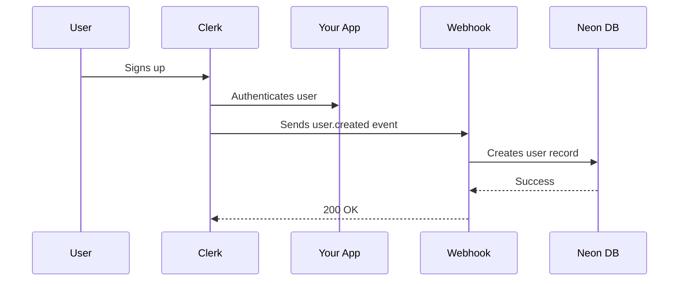

# Clerk Webhook Setup Guide

## 🎯 Purpose

This webhook ensures that when users sign up via Clerk authentication, their data is automatically saved to your Neon PostgreSQL database.

---

## 📋 Steps to Configure Clerk Webhook

### 1. **Get Your Webhook URL**

Your webhook endpoint is:
```
https://your-domain.com/api/webhooks/clerk
```

For local development with ngrok:
```bash
# Install ngrok if you haven't
# Download from: https://ngrok.com/download

# Start your Next.js dev server
npm run dev

# In another terminal, start ngrok
ngrok http 3000

# Copy the HTTPS URL (e.g., https://abc123.ngrok.io)
# Your webhook URL will be: https://abc123.ngrok.io/api/webhooks/clerk
```

---

### 2. **Configure Webhook in Clerk Dashboard**

1. Go to [Clerk Dashboard](https://dashboard.clerk.com/)
2. Select your application
3. Navigate to **Webhooks** in the left sidebar
4. Click **+ Add Endpoint**
5. Enter your webhook URL:
   - **Production**: `https://your-domain.com/api/webhooks/clerk`
   - **Development**: `https://your-ngrok-url.ngrok.io/api/webhooks/clerk`

6. Select the following events:
   - ✅ `user.created`
   - ✅ `user.updated`
   - ✅ `user.deleted`

7. Click **Create**

---

### 3. **Copy Webhook Secret**

After creating the webhook:

1. Click on your newly created webhook endpoint
2. You'll see a **Signing Secret** (starts with `whsec_...`)
3. Click **Copy** to copy the secret

---

### 4. **Add Secret to Environment Variables**

Open your `.env` file and add the webhook secret:

```env
CLERK_WEBHOOK_SECRET=whsec_your_secret_here
```

**Important**: Replace `whsec_your_secret_here` with your actual signing secret from step 3.

---

### 5. **Restart Your Development Server**

After adding the environment variable:

```bash
# Stop the server (Ctrl+C)
# Start it again
npm run dev
```

---

## ✅ Verification

### Test the Webhook

1. **Sign up a new user** via your application
2. **Check Clerk Dashboard** → Webhooks → Click on your endpoint → Check **Recent Events**
   - You should see a `user.created` event with status `200 OK`

3. **Check Neon Database**:
   - Go to [Neon Console](https://console.neon.tech/)
   - Navigate to your database
   - Run this query in the SQL Editor:
     ```sql
     SELECT * FROM "User";
     ```
   - You should see your new user record!

---

## 🐛 Troubleshooting

### Webhook Returns 400 Error

**Cause**: Webhook secret is incorrect or missing

**Fix**:
- Double-check `CLERK_WEBHOOK_SECRET` in `.env`
- Ensure you copied the entire secret including `whsec_` prefix
- Restart your dev server

---

### Webhook Returns 500 Error

**Cause**: Database connection issue or Prisma client not initialized

**Fix**:
```bash
# Regenerate Prisma client
npx prisma generate

# Push schema to database
npx prisma db push

# Restart dev server
npm run dev
```

---

### User Not Appearing in Database

**Cause**: Webhook not receiving events

**Fix**:
1. Check Clerk Dashboard → Webhooks → Recent Events
2. Ensure events are being sent and receiving `200 OK`
3. Check your Next.js console for error logs

---

## 📝 Production Deployment

When deploying to production (e.g., Vercel):

1. **Update webhook URL** in Clerk Dashboard to your production domain
   ```
   https://your-production-domain.com/api/webhooks/clerk
   ```

2. **Add environment variable** in your hosting platform:
   - Vercel: Settings → Environment Variables
   - Add: `CLERK_WEBHOOK_SECRET=whsec_your_secret`

3. **Redeploy** your application

---

## 🔒 Security Notes

- ✅ Webhook endpoint is public (no auth required)
- ✅ Requests are verified using Svix signature verification
- ✅ Only Clerk can successfully call this endpoint
- ✅ Webhook secret must remain private (never commit to git)

---

## 💡 What Happens When a User Signs Up?



Your user data now lives in both Clerk (for authentication) and your Neon database (for application data)!

---

**Need help?** Check the [Clerk Webhooks Documentation](https://clerk.com/docs/integrations/webhooks/overview)
