# n8n-nodes-docuwriter-ai


An **official and verified n8n community node** that integrates with [DocuWriter.ai](https://www.docuwriter.ai) - the AI-powered platform for automated code documentation, testing, and optimization.

[](https://badge.fury.io/js/n8n-nodes-docuwriter-ai)
[](https://opensource.org/licenses/MIT)

Full documentation here: [n8n + DocuWriter.ai](https://docs.docuwriter.ai/docuwriter-ain8n-nodes-docuwriter-ai/81340)
***Generated using DocuWriter.ai - Full Tree generator***

## Features

### 🔧 Core Capabilities

- **Code Documentation Generation**: Transform source code into comprehensive documentation
- **Automated Test Creation**: Generate test suites for your code
- **UML Diagram Generation**: Create visual representations of code architecture
- **Code Optimization**: Get AI-powered suggestions for improving code quality
- **Generation Management**: Access and retrieve previously generated content
- **User Info**: Check account status and credit balance
- **Webhook Support**: Real-time triggers when generations are created or updated

### 📚 Use Cases

- **CI/CD Integration**: Automatically generate documentation on code commits
- **Quality Assurance**: Create test suites for new features
- **Code Review Automation**: Generate optimization suggestions and architectural diagrams
- **Documentation Maintenance**: Keep project documentation up-to-date automatically

## Installation

### Prerequisites

- n8n version 0.198.0 or later (for official node support)
- DocuWriter.ai account and API token

### Installation Method

#### Official n8n Node (Recommended)

DocuWriter.ai is now an **official and verified n8n community node** available directly in the n8n editor:


1. In your n8n workflow editor, click **Add first step** or the **+** button
2. In the search field, type **"DocuWriter"**
3. Look for **"DocuWriter.ai"** under "More from the community"
4. Click on the DocuWriter.ai node to add it to your workflow

**Note**: No prior NPM installation is required - the node is now available as an official community node directly in the n8n editor.

#### Legacy Manual Installation

For older n8n instances or custom deployments:

```bash
# Install via npm (legacy method)
npm install n8n-nodes-docuwriter-ai
```

## Configuration

### 1. Get Your API Token

1. Visit [DocuWriter.ai](https://app.docuwriter.ai)
2. Sign up or log in to your account
3. Navigate to **Settings** > **API Keys**
4. Generate a new API token
5. Copy the token for use in n8n

### 2. Configure Credentials in n8n

1. In n8n, go to **Credentials**
2. Click **Create New Credential**
3. Search for and select **DocuWriter.ai API**
4. Fill in your credentials:
   - **API Token**: Your DocuWriter.ai API token
   - **Base URL**: `https://app.docuwriter.ai` (default)
5. Click **Save**

## How It Works

The DocuWriter.ai n8n integration provides seamless automation for code documentation, testing, and optimization:

### Integration Architecture


### Action Node Workflow


### Trigger Node Workflow


## Usage

The DocuWriter.ai integration provides two main node types:

## Action Node

The DocuWriter.ai action node provides multiple resources and operations for generating content:

### Resources

#### Code Documentation
Generate comprehensive documentation from source code.

**Parameters:**
- `sourceCode` (required): The source code to analyze
- `filename` (required): Filename for context
  (Mode is always Accurate)
- `outputLanguage`: Language for documentation (default: English)
- `documentationType`: Type of documentation to generate

#### Code Tests
Generate automated test suites.

**Parameters:**
- `sourceCode` (required): The source code to test
- `filename` (required): Filename for context
- `testFramework`: Testing framework to use (auto-detect available)
- `testType`: Type of tests (unit tests, etc.)

#### UML Diagram
Create visual diagrams from code structure.

**Parameters:**
- `sourceCode` (required): The source code to analyze
- `filename` (required): Filename for context
- `diagramType` (required): Type of UML diagram (class, sequence, use_case, activity, component, state, object)

#### Code Optimization
Get AI-powered code improvement suggestions.

**Parameters:**
- `sourceCode` (required): The source code to optimize
- `filename` (required): Filename for context
- `optimizationFocus`: Focus area (all, performance, readability, maintainability, security)

#### Generations
Retrieve previously generated content.

**Operations:**
- `Get All`: List all generations with optional filtering by type and limit
- `Get`: Retrieve a specific generation by ID

#### User Info
Get account information and remaining credits.

## Trigger Node

The DocuWriter.ai Trigger node allows you to create workflows that respond to events in DocuWriter.ai.

### Supported Events

- **Generation Created**: Triggers when a new generation is created
- **Generation Updated**: Triggers when a generation is updated

### Event Filtering

- **Filter by Generation Type**: Optionally filter events by specific generation types
- **Generation Types**: Choose from available types including Documentation, Tests, Optimizer, Converter, Swagger API Docs, Comment, Diagrams, and Git-based generations

### Webhook Payload Structure

```json
{
  "event": "generation.created",
  "timestamp": "2024-01-15T10:30:00Z",
  "data": {
    "uuid": "550e8400-e29b-41d4-a716-446655440000",
    "filename": "example.js",
    "generation_type": "[Basic] => Documentation",
    "generated_by_user": "user@example.com",
    "updated_at": "2024-01-15T10:30:00Z",
    "tag": "project-alpha"
  }
}
```

## Examples

### Basic Code Documentation

```json
{
  "resource": "codeDocumentation",
  "operation": "generate",
  "sourceCode": "function calculateTotal(items) {\n  return items.reduce((sum, item) => sum + item.price, 0);\n}",
  "filename": "calculator.js",
  
}
```

### Generate Tests

```json
{
  "resource": "codeTests",
  "operation": "generate",
  "sourceCode": "class User {\n  constructor(name) {\n    this.name = name;\n  }\n}",
  "filename": "User.js",
  "testFramework": "auto-detect"
}
```

### Create UML Class Diagram

```json
{
  "resource": "umlDiagram",
  "operation": "generate",
  "sourceCode": "public class Vehicle {\n  private String brand;\n  public void start() {}\n}",
  "filename": "Vehicle.java",
  "diagramType": "class"
}
```

## Workflow Examples

### Example: Automated Code Quality Pipeline

```mermaid
graph LR
    FU[File Upload Trigger] --> RF[Read File]
    RF --> DOC[Generate Documentation]
    RF --> TEST[Generate Tests]
    RF --> UML[Generate UML]
    RF --> OPT[Optimize Code]
    
    DOC --> REP[Create Quality Report]
    TEST --> REP
    UML --> REP
    OPT --> REP
    
    REP --> SAVE[Save Report]
    REP --> CHECK{Quality Score > 70?}
    
    CHECK -->|Yes| SLACK[✅ Success Notification]
    CHECK -->|No| EMAIL[⚠️ Quality Alert]
    
    SAVE --> GITHUB[Commit to Repository]
```



### Example: Real-time Generation Processing


We provide complete example workflows in the `/examples/workflows/` directory:

- **[Automated Testing Workflow](./examples/workflows/automated-testing-workflow.json)**: Generate tests, optimize code, and create UML diagrams
- **[Generation Created Webhook](./examples/workflows/generation-created-webhook.json)**: Process new generations in real-time

## API Reference

### Response Format

All DocuWriter.ai API responses follow this format:

```json
{
  "success": true,
  "data": {
    // Generated content and metadata
  }
}
```

### Error Handling

When an error occurs, the response will include error information. The node supports n8n's built-in error handling and will return execution data even on failures when "Continue on Fail" is enabled.

## Troubleshooting

### Common Issues

#### Authentication Failed
**Solution**: Verify your API token in the credentials configuration and ensure it's valid.

#### Code Too Large
**Solution**: Break down large files into smaller components or use the "Faster" mode.

#### No Credits Remaining
**Solution**: Check your account status and upgrade your DocuWriter.ai subscription if needed.

### Debug Mode

Enable debug logging in n8n to troubleshoot issues:

1. Check n8n execution logs for detailed error information
2. Verify request/response data in the execution history
3. Test credentials using the built-in test functionality

## Support

### Documentation
- [n8n Community Forum](https://community.n8n.io)

### Contact
- **Email**: support@docuwriter.ai
- **GitHub Issues**: [Report bugs](https://github.com/DocuWriter-ai/n8n-nodes-docuwriter-ai/issues)

## Contributing

We welcome contributions! Please feel free to submit issues and pull requests.

1. Fork the repository
2. Create a feature branch
3. Make your changes
4. Submit a pull request

## License

This project is licensed under the MIT License - see the [LICENSE](LICENSE) file for details.

## Changelog

### v1.1.1
- **API Migration Complete**: All endpoints now use the unified
- Added support for Swagger API generation
- Added support for Repository listing
- Enhanced error handling and validation
- Improved documentation and examples

### v1.1.0
- **BREAKING CHANGE**: Migrated to unified GenerationsController API endpoints
- Updated all endpoints to use the standardized `/api/generate-*` paths
- Added support for code comments generation
- Updated UML diagram generation to use new API
- Updated generations listing and retrieval to use new API
- Updated user info endpoint to use new API
- Improved parameter handling and validation
- Better consistency with DocuWriter.ai platform API standards

### v1.0.8
- Fixed "Invalid URL" error by properly constructing full API URLs
- Improved error handling and URL validation
- Removed unnecessary requestDefaults configuration

### v1.0.7
- Fixed icons not displaying in n8n interface
- Updated build process to correctly copy SVG icon files to dist directory
- Added cross-platform copyfiles dependency for better build compatibility

### v1.0.2
- Updated documentation to reflect actual implemented features
- Removed unimplemented workflow examples
- Cleaned up README to accurately describe available functionality

### v1.0.1
- Fixed repository URL to point to correct GitHub organization

### v1.0.0
- Initial release
- Core documentation generation
- Test suite creation
- UML diagram generation
- Code optimization features
- Generation management
- User info retrieval
- Webhook trigger support
- Complete n8n integration

---

Built with ❤️ by the [DocuWriter.ai](https://www.docuwriter.ai) team