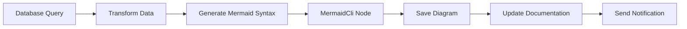

# n8n-nodes-mermaid

[](https://badge.fury.io/js/n8n-nodes-mermaid)
[](https://opensource.org/licenses/MIT)
[](https://n8n.io)

This is an n8n community node package that enables powerful **Mermaid diagram generation** capabilities within your n8n workflows. Transform data into beautiful diagrams including flowcharts, sequence diagrams, Gantt charts, and more using the robust Mermaid CLI with Chromium rendering.

[Mermaid](https://mermaid.js.org/) is a popular JavaScript-based diagramming and charting tool that renders markdown-inspired text definitions to create and modify diagrams dynamically. This node brings that power directly into your n8n automation workflows.

[n8n](https://n8n.io/) is a [fair-code licensed](https://docs.n8n.io/reference/license/) workflow automation platform.

## Quick Links

[Installation](#installation) •
[Operations](#operations) •
[Examples](#examples) •
[Compatibility](#compatibility) •
[Development](#development) •
[Resources](#resources)

## Installation

Follow the [installation guide](https://docs.n8n.io/integrations/community-nodes/installation/) in the n8n community nodes documentation.

### Install via n8n Interface

1. Go to **Settings** > **Community Nodes** in your n8n instance
2. Enter `n8n-nodes-mermaid` as the package name
3. Click **Install**

### Install via npm

```bash
npm install n8n-nodes-mermaid
```

### Install via Docker

For Docker installations, add the package to your n8n container:

```dockerfile
FROM n8nio/n8n
USER root
RUN npm install -g n8n-nodes-mermaid
USER node
```

## Features

🎨 **Multiple Diagram Types**: Support for all Mermaid diagram types including flowcharts, sequence diagrams, Gantt charts, class diagrams, state diagrams, and more

🔧 **5 Comprehensive Operations**: Generate, validate, convert, render to binary, and batch process diagrams

📁 **Multiple Output Formats**: PNG, SVG, and PDF output support with configurable dimensions

🔄 **Flexible Input Sources**: Accept Mermaid syntax from text input or file paths

📦 **Binary Data Support**: Generate diagrams as binary attachments for emails, APIs, or file storage

⚡ **Batch Processing**: Process multiple diagram files efficiently with parallel execution support

🛡️ **Syntax Validation**: Validate Mermaid syntax before rendering to catch errors early

🐳 **Docker Ready**: Includes Chromium browser support for containerized environments

## Operations

The **MermaidCli** node provides five powerful operations:

### 1. Generate Diagram
Create Mermaid diagrams with multiple output delivery modes:
- **File Content**: Returns diagram as base64-encoded content
- **Binary Data**: Generates binary attachment for downstream processing
- **File Path**: Saves diagram to specified location and returns path

**Use Cases**: 
- Dynamic workflow documentation
- Data visualization from database queries
- Automated report generation with charts

### 2. Render to Binary
Specifically designed for generating binary attachments with proper MIME types:
- Optimal for email attachments
- API response embedding
- File storage systems
- Integration with cloud services

**Use Cases**:
- Email automation with diagram attachments
- API responses with visual data
- Automated backup with visual summaries

### 3. Validate Syntax
Check Mermaid syntax for errors before processing:
- Supports all Mermaid diagram types
- Detailed validation reporting
- Error prevention in workflows

**Use Cases**:
- Quality assurance in documentation pipelines
- User input validation
- Batch processing pre-checks

### 4. Convert Format
Transform existing diagram files between formats:
- Input: Existing Mermaid files
- Output: PNG, SVG, or PDF
- Batch-compatible processing

**Use Cases**:
- Format standardization
- Legacy diagram migration
- Multi-format publishing

### 5. Batch Process
Process multiple diagram files efficiently:
- Directory pattern matching
- Parallel or sequential processing
- Comprehensive progress reporting
- Error handling per file

**Use Cases**:
- Documentation site generation
- Bulk diagram conversion
- Repository-wide diagram updates

## Examples

### Basic Flowchart Generation

```javascript
// Input Mermaid syntax
flowchart TD
    A[Start] --> B{Is it working?}
    B -->|Yes| C[Great!]
    B -->|No| D[Debug]
    D --> B
    C --> E[End]
```

### Sequence Diagram for API Documentation

```javascript
// Generate sequence diagram from workflow data
sequenceDiagram
    participant User
    participant API
    participant Database
    
    User->>API: Request Data
    API->>Database: Query
    Database-->>API: Results
    API-->>User: Response
```

### Gantt Chart from Project Data

```javascript
// Create project timeline from database
gantt
    title Project Timeline
    dateFormat YYYY-MM-DD
    
    section Phase 1
    Task 1: 2024-01-01, 30d
    Task 2: after task1, 20d
    
    section Phase 2
    Task 3: 2024-02-15, 25d
```

### Workflow Example: Automated Documentation



## Configuration Options

### Output Formats
- **PNG**: Raster format, ideal for presentations and documents
- **SVG**: Vector format, perfect for web and scalable graphics  
- **PDF**: Document format, great for reports and printing

### Rendering Options
- **Width/Height**: Custom dimensions (default: 800x600)
- **Theme**: Default, dark, forest, neutral themes
- **Background Color**: Configurable background colors
- **Quality Settings**: Adjustable for file size vs. quality balance

### CLI Environment
- **Chromium Integration**: Uses @mermaid-js/mermaid-cli with Chromium rendering
- **Container Support**: Proper environment variables for Docker/Kubernetes
- **Error Handling**: Comprehensive error reporting and recovery

## Compatibility

- **Minimum n8n version**: 1.82.0
- **Node.js requirement**: 20.15 or higher
- **Mermaid version**: 11.9.0
- **Tested environments**: Docker, Kubernetes, local installations

### Browser Dependencies

This node requires a Chromium browser for diagram rendering. In containerized environments:

```dockerfile
# Install Chromium browser
RUN apt-get update && apt-get install -y chromium-browser

# Set environment variables
ENV PUPPETEER_EXECUTABLE_PATH=/usr/bin/chromium-browser
ENV CHROME_BIN=/usr/bin/chromium-browser
```

## Development

### Local Development Setup

```bash
# Clone the repository
git clone https://github.com/RustedVikingOG/n8n-nodes-mermaid.git
cd n8n-nodes-mermaid

# Install dependencies
npm install

# Development mode (watch)
npm run dev

# Build for production
npm run build

# Lint and format code
npm run lint
npm run format
```

### Testing Environment

The project includes a Docker-based testing environment:

```bash
cd n8n_test_env
docker-compose -f compose.n8n-service.yaml up
```

This provides:
- Complete n8n environment with the MermaidCli node
- Chromium browser support
- Volume mounting for test files
- Development and debugging capabilities

### Project Structure

```
nodes/MermaidCLI/          # Main node implementation
├── MermaidCli.node.ts     # Core node logic with 5 operations
├── MermaidOperations.ts   # Operation definitions and configurations
├── MermaidCli.node.json   # Node metadata and registration
└── mermaid.svg           # Node icon for n8n interface

n8n_test_env/             # Docker testing environment
├── compose.n8n-service.yaml
├── Dockerfile
└── mnt/                  # Test files and outputs

docs/                     # Comprehensive documentation
├── designs/              # Architecture and use cases
└── COLLABORATION.md      # Development guidelines
```

## Troubleshooting

### Common Issues

**"Unexpected eof" Errors**
- Check for missing brackets, quotes, or proper Mermaid syntax
- Validate input using the Validate operation first

**CLI Execution Failures**
- Ensure Chromium browser is installed and accessible
- Check environment variables in containerized deployments
- Verify @mermaid-js/mermaid-cli is properly installed

**Docker Environment Issues**
- Ensure containers have proper browser dependencies
- Check volume mounts and permissions
- Verify environment variables for Puppeteer

**Icon Display Problems**
- Rebuild the project: `npm run build`
- Check that SVG files are copied to dist directory

### Debug Mode

Enable detailed logging by setting n8n log level:

```bash
export N8N_LOG_LEVEL=debug
n8n start
```

## Resources

- **n8n Documentation**: [Community Nodes](https://docs.n8n.io/integrations/#community-nodes)
- **Mermaid Documentation**: [Official Docs](https://mermaid.js.org/)
- **Mermaid CLI**: [@mermaid-js/mermaid-cli](https://github.com/mermaid-js/mermaid-cli)
- **Project Repository**: [GitHub](https://github.com/RustedVikingOG/n8n-nodes-mermaid)
- **Issue Tracking**: [GitHub Issues](https://github.com/RustedVikingOG/n8n-nodes-mermaid/issues)

### Mermaid Diagram Examples
- **Flowcharts**: [Documentation](https://mermaid.js.org/syntax/flowchart.html)
- **Sequence Diagrams**: [Documentation](https://mermaid.js.org/syntax/sequenceDiagram.html)
- **Gantt Charts**: [Documentation](https://mermaid.js.org/syntax/gantt.html)
- **Class Diagrams**: [Documentation](https://mermaid.js.org/syntax/classDiagram.html)

## Contributing

We welcome contributions! Please see our [Collaboration Guide](docs/1.COLLABORATION.md) for:
- Development environment setup
- Code style guidelines
- Contribution workflow
- Architecture documentation

## License

[MIT](LICENSE.md) © 2024 RustedVikingOG

## Version History

### v0.1.4 (Latest)
- Updated comprehensive README with detailed documentation
- Enhanced examples and use case descriptions
- Improved installation and troubleshooting guides
- Complete project documentation overhaul

### v0.1.3
- Complete MermaidCli node implementation with 5 operations
- Docker testing environment with Chromium support
- Comprehensive documentation and examples
- TypeScript build system with asset processing

---

**Ready to visualize your workflows?** Install n8n-nodes-mermaid and start creating beautiful diagrams directly in your automation pipelines!
